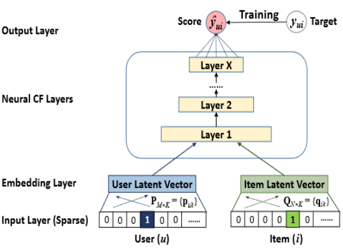
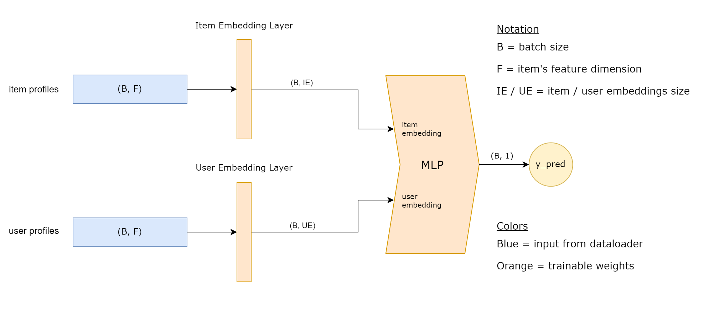
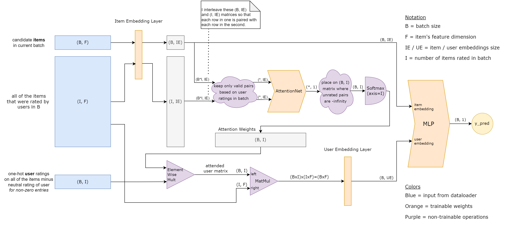
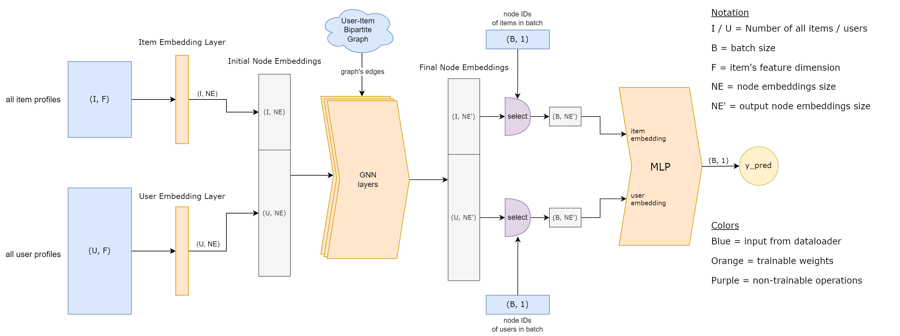

# Deep Hybrid Recommendation

In this project we develop a Hybrid Recommendation System based on neural networks by combining the **Neural Collaborative Filtering (NCF)**
framework [1] with content-based methods for item and user profiles. More specifically, we developed three distinct 
neural network architectures: **Basic NCF**, **Attention NCF** and **Graph NCF**. 

**Basic NCF** is vanilla NCF but with content-based profiles representing users and items instead of one-hot vectors. 

**Attention NCF** creates the user profiles dynamically, during the forward pass, where, inspired from the work in [2], 
it calculates an attention weight between the item of the input user-item interaction and every rated item that will make up the user profile. 
Using this item-item attention mechanism, it has the ability to learn to attend differently to rated items depending on 
the item that it is being called to predict a preference score for. This does not only result in better performance, 
but also in some much needed explainability, as we can offer highly attended rated items as an explanation for why an item is being recommended to a user.

**Graph NCF** uses fixed user and item profiles like the first one, but it also attempts to learn better user and item embeddings by explicitly 
capturing the collaborative signal on the user-item bipartite graph via Graph Neural Networks, following the work in [3] and [4].


### Neural Collaborative Filtering

Suppose we have access to **users**, **items** and **recorded interactions** between them. 


Given a user **u** and an item **i**, the goal of a Collaborative Filtering method is typically to predict a preference score **f**(**u**, **i**) between user **u** and item **i**.

In NCF we learn that function **f** from recorded user-item interactions using a **neural network**, as shown below. 



[//]: # (Given appropriate user and item vectors representing **u** and **i** &#40;e.g. one-hot vectors, feature vectors, etc&#41;, )

[//]: # (we embed them into their own embedding space using a separate projection layer for each &#40;these are learnt during training&#41;, )

[//]: # (then we concatenate the two resulting item and user embeddings and pass them into a multi-layer perceptron &#40;aka Neural CF Layers&#41;)

[//]: # (until we get the predicted preference score for the pair.)


### Basic NCF

Basic NCF is just NCF.



### Attention NCF 

Attention NCF constructs the user profiles from item profiles dynamically, instead of using fixed ones. In doing so, it
also calculates an attention weight between the candidate item and each rated item. After having built the user profile we 
still embed it using a separate embedding layer.



### Graph NCF

Graph NCF uses GNNs as encoders in the embedding process of users and items before forwarding their final embeddings
into the MLP as in NCF.




## Environment installation

For the code of this project, the PyTorch and PyTorch Geometric frameworks were used along with other libraries like pandas, numpy, etc.

To recreate the exact development conda environment you can use the `env.yml` file and the command:

```
conda env create -f env.yml
```


## Project Organization

The code is divided in two main parts, the one inside the `neural_collaborative_filtering/` folder 
and the rest. Everything in the `neural_collaborative_filtering/` folder is meant to be very generic and flexible 
so that it can be easily applied to any similarly formulated problem simply by extending some classes. 
Everything else is problem-specific to the task of movie recommendations or wrapper logic and can serve as a usage example.

Basically, all you need to do to apply these models on a different use case is implement your own content providers
by extending the abstract classes in `neural_collaborative_filtering/content_providers.py` (e.g. like we have done in the `content_providers/` folder for our own task).
You may also need to change some hardcoded logic in the `neural_collaborative_filtering/datasets/` folder depending on your format of your data, which is probably going to be different.
Everything else in `neural_collaborative_filtering/` should be good to go as is.


## References

[1] https://arxiv.org/abs/1708.05031

[2] https://arxiv.org/abs/1801.08284

[3] https://arxiv.org/abs/1905.08108

[4] https://arxiv.org/abs/2002.02126